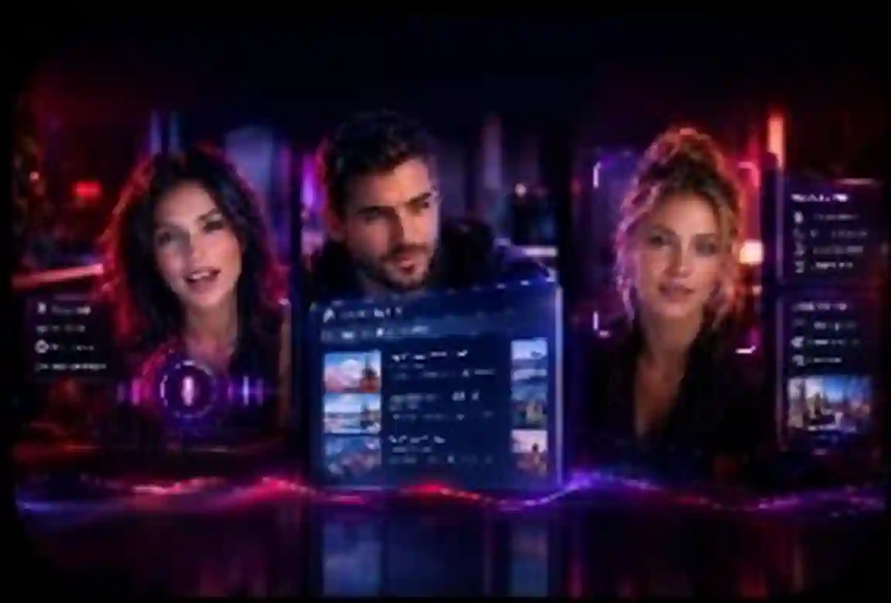

# RED LIVE

> **RED LIVE — the face-to-face AI experience**

  

  

RED LIVE is the live-avatar application for persistent, hands-free AI conversations.

## Experience

RED LIVE brings real-time animated avatars, natural voice conversation, memory, camera awareness and live web tools into one mobile-friendly experience.

Included:
- Realtime talking avatar through Realtime Avatar + LiveKit
- Full-duplex microphone conversation and interruption
- Server-authorized camera capability
- Custom portrait to live-avatar creation
- Persistent local conversation history and saved memory
- Saved memory synchronized into the secure live-session context
- Optional OpenAI-compatible text-model adapter
- Android-friendly installable web app
- One Node/Hono service for both UI and secure API

## Deploy

The repository includes `render.yaml` for a free Render web service.

Required secret:
`REALTIME_AVATAR_API_KEY`

Optional text-model variables:
`LLM_BASE_URL`
`LLM_API_KEY`
`LLM_MODEL`

Never put the realtime provider key in browser code. The provider requires it to stay server-side.

## Local

Run `npm install`, set `REALTIME_AVATAR_API_KEY` on the server, and run `npm start`. Open the resulting localhost address. Microphone access requires HTTPS or localhost.

## Cost

RED LIVE itself does not add a subscription or paywall.
